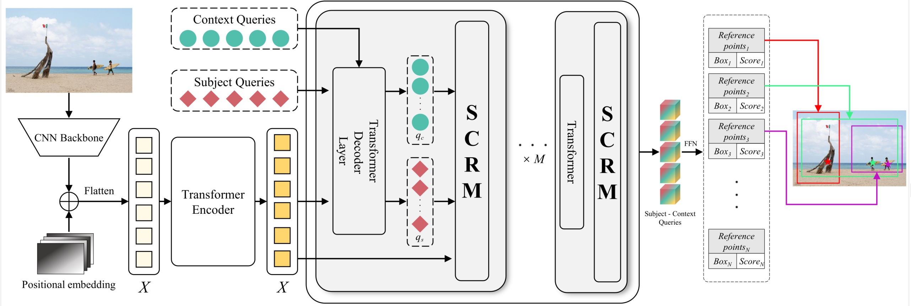

# Multi in One: Multi-Subject Image Cropping with Subject-Context Relationship

Existing image cropping methods typically rely on evaluating predefined or dynamically generated views from a holistic perspective. However, when the image contains rich content, these view-based methods exhibit two limitations. Firstly, when multiple subjects are present in an image, these methods struggle to locate and crop them, limiting the diversity of cropping results. Secondly, they have difficulty extracting the relationship between the subject and the relevant context in the image, resulting in crops that are aesthetically poor and compositionally unreasonable. To address these limitations, we focus on the definition of composition, emphasizing the significance of the subject and visual elements, and redefine image cropping as a problem of reference point prediction and interaction relationship modeling. By matching reference points to different subjects in the image, our method can regress diverse cropping results through a single-stage process. Recognizing the influence of subject and context interactions on composition, we propose a Subject-Context Relationship Module (SCRM). By constructing the subject-context relationship pairs, SCRM can effectively capture dependency information, enabling the generation of more reasonable and higher-quality crops. We conduct comprehensive quantitative and qualitative experiments on public datasets, and the results demonstrate that our method outperforms other state-of-the-art baselines.

## Requirements

- Linux, CUDA>=9.2, GCC>=5.4
- Python: 3.9.7
- PyTorch: 1.10.0 (CUDA 11.3)
- Torchvision: 0.11.0

## Training

Follow the steps below to prepare the environment, data, and start training:

1. Download the [Pretrained Model on COCO](https://drive.google.com/file/d/1nDWZWHuRwtwGden77NLM9JoWe-YisJnA/view?usp=sharing) and change the path in the main_sacd.py

2. Download the SACD Dataset and change the path in the main_sacd.py

3. Use the following command to launch distributed training across 2 GPUs:
   > GPUS_PER_NODE=2 ./tools/run_dist_launch.sh 2 ./configs/r50_crop.sh

## Testing
Once you have obtained the trained model, modify the config for inference.  
To run evaluation, add `--eval` and `--resume <checkpoint_path>` to the end of the command.

## More results

